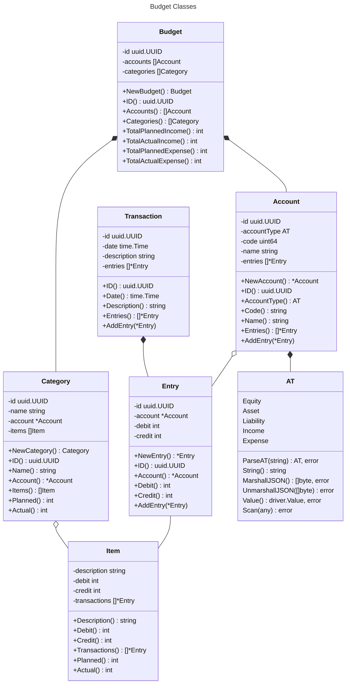
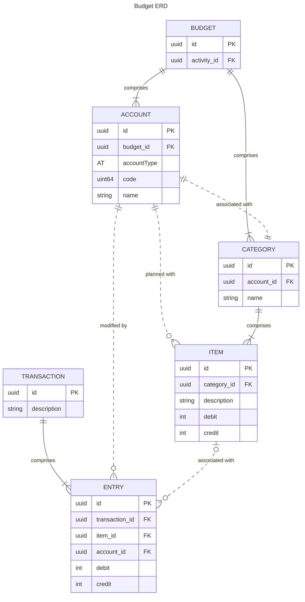

# Budget Models

Budget objects fall into two categories:

1. planned financial actions consisting of:
    - `Category`
    - `Item`
2. actual financial actions consisting of:
    - `Account`
    - `Transaction`
    - `Entry`

The `Budget` object unifies these into a single object that can be associated
with an `Activity`.

## Planned Financial Actions Classes

### Category

### Item

## Actual Financial Actions Classes

### Account

### Transaction

### Entry

