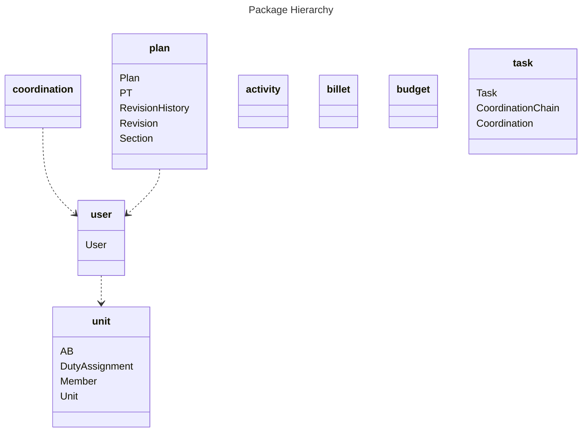
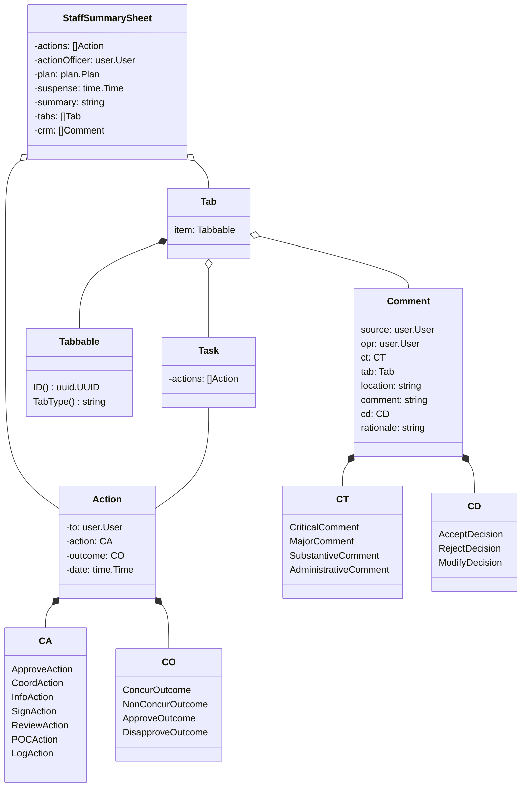
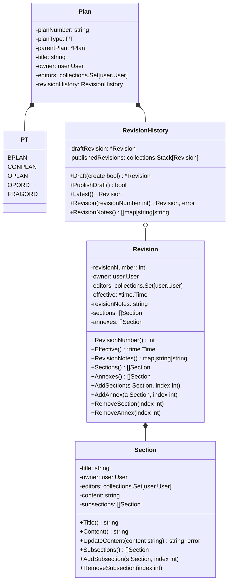
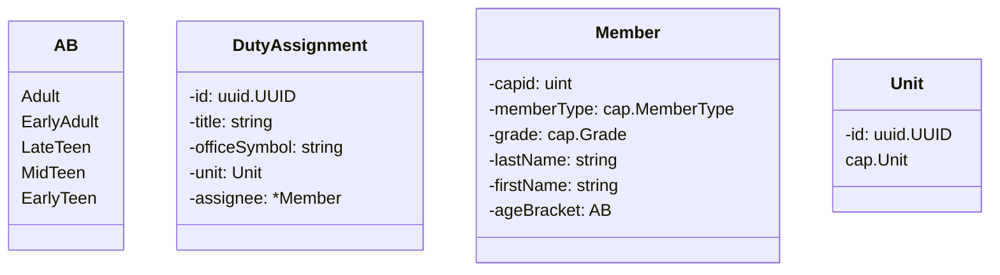

# Class Diagrams

## Activity Module

## Billeting Module

## Budgeting Module

## Coordination Module

## Planning Module

## Unit Module

Age Brackets:

- Adult: 21+
- Early Adult: 18-20
- Late Teen: 16-17
- Mid Teen: 14-15
- Early Teen: 12-13

## User Module

# Entity Relationship Diagrams