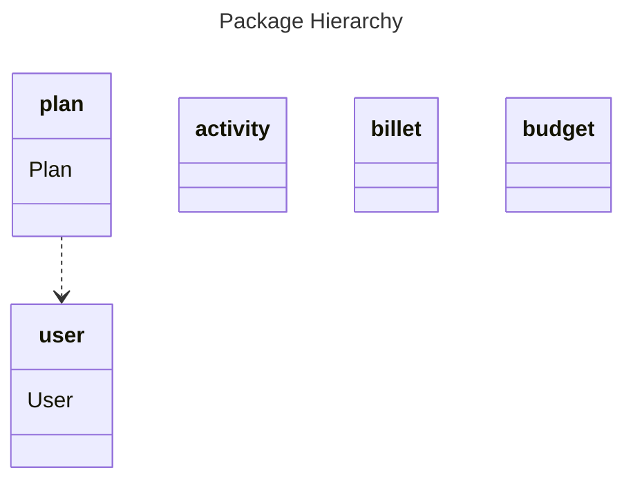
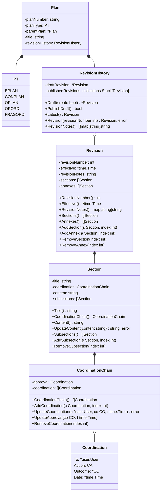

# Class Diagrams

```mermaid
---
title: Package Hierarchy
---

classDiagram
    plan ..> user

    class activity {
    }

    class billet {
    }

    class budget {
    }

    class plan {
        Plan
    }

    class user {
        User
    }

```

## Activity Module

## Billeting Module

## Budgeting Module

## Planning Module

```mermaid
classDiagram
    Plan *-- PT
    Plan *-- RevisionHistory
    RevisionHistory o-- Revision
    Revision *-- Section
    Section *-- CoordinationChain
    CoordinationChain o-- Coordination

    class Plan {
        -planNumber: string
        -planType: PT
        -parentPlan: *Plan
        -title: string
        -revisionHistory: RevisionHistory
    }

    class PT {
        BPLAN
        CONPLAN
        OPLAN
        OPORD
        FRAGORD
    }

    class RevisionHistory {
        -draftRevision: *Revision
        -publishedRevisions: collections.Stack[Revision]
        +Draft(create bool) *Revision
        +PublishDraft() bool
        +Latest() Revision
        +Revision(revisionNumber int) Revision, error
        +RevisionNotes() []map[string]string
    }

    class Revision {
        -revisionNumber: int
        -effective: *time.Time
        -revisionNotes: string
        -sections: []Section
        -annexes: []Section
        +RevisionNumber() int
        +Effective() *time.Time
        +RevisionNotes() map[string]string
        +Sections() []Section
        +Annexes() []Section
        +AddSection(s Section, index int)
        +AddAnnex(a Section, index int)
        +RemoveSection(index int)
        +RemoveAnnex(index int)
    }

    class Section {
        -title: string
        -coordination: CoordinationChain
        -content: string
        -subsections: []Section
        +Title() string
        +CoordinationChain() CoordinationChain
        +Content() string
        +UpdateContent(content string) string, error
        +Subsections() []Section
        +AddSubsection(s Section, index int)
        +RemoveSubsection(index int)
    }

    class CoordinationChain {
        -approval: Coordination
        -coordination: []Coordination
        +CoordinationChain() []Coordination
        +AddCoordination(c Coordination, index int)
        +UpdateCoordination(u *user.User, co CO, t time.Time) error
        +UpdateApproval(co CO, t time.Time)
        +RemoveCoordination(index int)
    }

    class Coordination {
        To: *user.User
        Action: CA
        Outcome: *CO
        Date: *time.Time
    }

    
```

## User Module

# Entity Relationship Diagrams