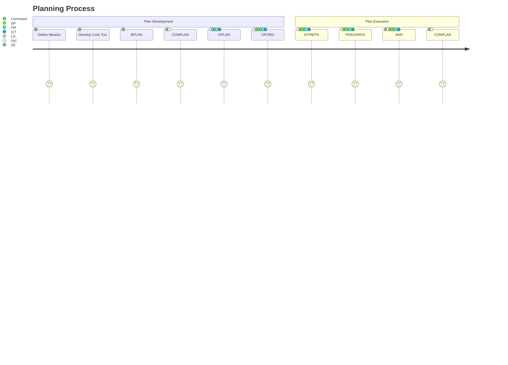
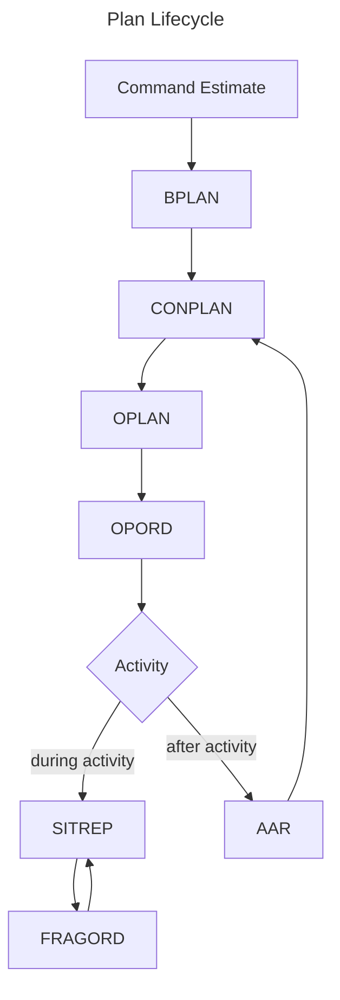

# Plans

## Planning Detail

The plans module facilitates the planning process from initial idea to full OPORD.
The philosophy borrows from JP 5-0 and supports the levels of planning detail
described in that manual:

1. Command Estimate
2. Base Plan (BPLAN)
3. Concept Plan (CONPLAN)
4. Operation Plan (OPLAN)
5. Operation Order (OPORD)

### 5-Section Format

The following discussion assumes that all plans follow the standard military 
5-section format:

1. Situation
2. Mission
3. Execution
4. Sustainment
5. Command and Control

Military plans (particularly OPLANS and OPORDS) will also contain a number of
annexes that drill down into certain planning details that are relevant only
to certain operational stakeholders. Generally speaking, the only information
that should be contained in the main 5 sections is the information that is germane
to *all* stakeholders. JP 5-0 defines a standard annex format, but while the 
existence of annexes are assumed in this discussion, we do not assume that they
follow the JP 5-0 convention.

### Command Estimate

A command estimate isn't a plan, proper. It will generally contain the mission 
statement and high-level discussions of possible courses of action (COAs). The
purpose of the command estimate is to get staff to agree on what needs to be 
accomplished and to begin the discussion of selecting a COA.

### Base Plan (BPLAN)

The Base Plan is developed after a COA has been selected. It consists of section 2
(the mission statement) and the Concept of Operations (CONOPS). The CONOPS is the 
part of a plan's section 3 (Execution) that describes what is to be done and in what 
order. It will contain the Command Intent (which describes the purpose of the 
operation, the methods that will be used, and the desired end state) and a breakdown 
of operations by phase, if appropriate. In a CAP context, instead of breaking down by 
phase, it is sometimes appropriate to break down by day.

### Concept Plan (CONPLAN)

Developing a CONPLAN from a BPLAN involves filling out the remainder of section 3
(enumerating tasks, establishing coordination instructions, etc.) and filling in
sections 1, 4, and 5. If annexes are filled in, it is only in template form (e.g.
the encampment org chart in the Task Organization annex). A complete CONPLAN should
describe higher headquarters, relevant policy objectives, and the general safety
plan (section 1), Command Intent, CONOPS, tasks, and coordination (section 3), the
Concept of Sustainment, finance, food, sanitation, supply, transportation, billeting, 
admin and personnel functions, public affairs and marketing functions, and safety, 
health services, and chaplain support functions (section 4), command relationships, 
succession to command, command posts, computer systems, and communications systems
(section 5). The only information that should be left to fill in to execute on the
plan should be details of who, when, and how much. 

Generally speaking, a CONPLAN will be location agnostic, but this is not a
hard-and-fast rule. Changing the location of some activities (e.g. encampment) could 
change them significantly enough to warrant a rewrite of the CONPLAN. For these
activities, the best thing to do is to draft an entirely location-agnostic BPLAN and
then develop CONPLANS for each potential location for the activity from the BPLAN.

### Operation Plan (OPLAN)

Up until this point, the activity has been conceived of in the abstract. Developing
an OPLAN is where planners stop thinking about an activity and start thinking about 
the next activity. An OPLAN has no blanks or placeholders in the 5 sections and has
fully developed annexes appropriate to the activity. In steady-state, the activity
staff's full efforts are focused on fleshing out the CONPLAN into a workable OPLAN
during the planning of an activity.

### Operation Order (OPORD)

In Civil Air Patrol, all activities are authorized under the administrative control
(ADCON) of a unit, group, wing, or region commander or the National Commander. Once 
the activity is authorized by the commander with ADCON, the activity director is
delegated operational control (OPCON) over the activity. The director is still
responsible to the commander who authorized the activity in the first place, and to
ensure the commander retains material control over their command, the OPLAN should
be submitted to the ADCON commander for final approval before the activity begins.
Once the OPLAN is approved, it becomes an Operation Order (OPORD).

## Planning Process

The following general process is assumed planning and executing a CAP activity:

Note how the output artifact of executing the plan is a CONPLAN. In steady-state,
activities are likely to be executed time and again. Most of the time&mdash;unless
command significantly changes the purpose of the activities&mdash;80% of the activity
will be the same from instance to instance. This is, fundamentally, the purpose of
the CONPLAN. New OPLANs are developed from the templates of the things that don't
change. At the end of every activity, CAP requires an After Action Review (AAR). The
intent of the AAR is to identify things that worked well and need to be kept in
future iterations of the activity, and identify the things that didn't work well and
identify what needs to be done to make those parts of the activity better. The hard
part of any AAR is ensuring the AAR's lessons are preserved in the next iteration of
the activity. With this process, the lessons of the AAR are incorporated into the
CONPLAN, where appropriate, ensuring those lessons are captured in the artifact that
the next activity director uses to begin planning the next activity.

Another way of looking at this process is the lifecycle of an activity plan:

